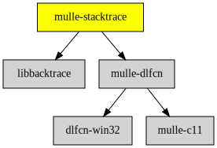

# mulle-stacktrace

#### 👣 Stracktrace support for various OS

The idea here is to have a unified library for stacktraces.
It now defaults to [libbacktrace](https://github.com/ianlancetaylor/libbacktrace)`
as the actual stacktrace implemntation.


| Release Version                                       | Release Notes  | AI Documentation
|-------------------------------------------------------|----------------|---------------
|  [](//github.com/mulle-core/mulle-stacktrace/actions) | [RELEASENOTES](RELEASENOTES.md) | [DeepWiki for mulle-stacktrace](https://deepwiki.com/mulle-core/mulle-stacktrace)


## API

### Core Functions

**mulle_stacktrace_once( fp)** - Print current stacktrace to file pointer
**mulle_stacktrace( stacktrace, fp)** - Print with custom stacktrace configuration
**_mulle_stacktrace( stacktrace, offset, format, fp)** - Full control with format options

### Format Options

| Option                      | Description
|-----------------------------|--------------------------------
| `mulle_stacktrace_normal`   | Full stacktrace
| `mulle_stacktrace_trimmed`  | Remove system frames (default)
| `mulle_stacktrace_linefeed` | One frame per line
| `mulle_stacktrace_csv`      | CSV format

### Example

```c
#include <mulle-stacktrace/mulle-stacktrace.h>

void foo()
{
   // Simple usage - print trimmed stacktrace
   mulle_stacktrace_once( stdout);

   // Full control - print with linefeeds, skip 1 frame
   _mulle_stacktrace( NULL, 1, mulle_stacktrace_linefeed, stdout);
}
```


### You are here




## Add

**This project is a component of the [mulle-core](//github.com/mulle-core/mulle-core) library. As such you usually will *not* add or install it
individually, unless you specifically do not want to link against
`mulle-core`.**


### Add as an individual component

Use [mulle-sde](//github.com/mulle-sde) to add mulle-stacktrace to your project:

``` sh
mulle-sde add github:mulle-core/mulle-stacktrace
```

To only add the sources of mulle-stacktrace with dependency
sources use [clib](https://github.com/clibs/clib):


``` sh
clib install --out src/mulle-core mulle-core/mulle-stacktrace
```

Add `-isystem src/mulle-core` to your `CFLAGS` and compile all the sources that were downloaded with your project.


## Install

Use [mulle-sde](//github.com/mulle-sde) to build and install mulle-stacktrace and all dependencies:

``` sh
mulle-sde install --prefix /usr/local \
   https://github.com/mulle-core/mulle-stacktrace/archive/latest.tar.gz
```

### Legacy Installation

Install the requirements:

| Requirements                                 | Description
|----------------------------------------------|-----------------------
| [mulle-dlfcn](https://github.com/mulle-core/mulle-dlfcn)             | ♿️ Shared library helper

Download the latest [tar](https://github.com/mulle-core/mulle-stacktrace/archive/refs/tags/latest.tar.gz) or [zip](https://github.com/mulle-core/mulle-stacktrace/archive/refs/tags/latest.zip) archive and unpack it.

Install **mulle-stacktrace** into `/usr/local` with [cmake](https://cmake.org):

``` sh
PREFIX_DIR="/usr/local"
cmake -B build                               \
      -DMULLE_SDK_PATH="${PREFIX_DIR}"       \
      -DCMAKE_INSTALL_PREFIX="${PREFIX_DIR}" \
      -DCMAKE_PREFIX_PATH="${PREFIX_DIR}"    \
      -DCMAKE_BUILD_TYPE=Release &&
cmake --build build --config Release &&
cmake --install build --config Release
```


## Author

[Nat!](https://mulle-kybernetik.com/weblog) for Mulle kybernetiK  


